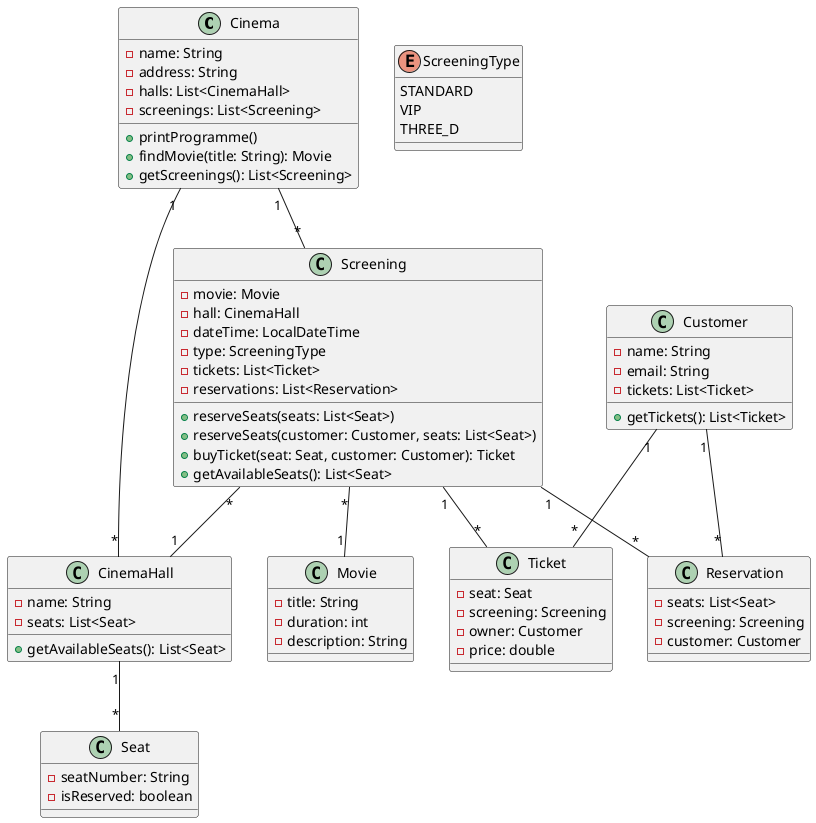

## Class Diagram

```plantuml
@startuml

class Cinema {
    - name: String
    - address: String
    - halls: List<CinemaHall>
    - screenings: List<Screening>
    + printProgramme()
    + findMovie(title: String): Movie
    + getScreenings(): List<Screening>
}

class CinemaHall {
    - name: String
    - seats: List<Seat>
    + getAvailableSeats(): List<Seat>
}

class Movie {
    - title: String
    - duration: int
    - description: String
}

class Screening {
    - movie: Movie
    - hall: CinemaHall
    - dateTime: LocalDateTime
    - type: ScreeningType
    - tickets: List<Ticket>
    - reservations: List<Reservation>
    + reserveSeats(seats: List<Seat>)
    + reserveSeats(customer: Customer, seats: List<Seat>)
    + buyTicket(seat: Seat, customer: Customer): Ticket
    + getAvailableSeats(): List<Seat>
}

class Seat {
    - seatNumber: String
    - isReserved: boolean
}

class Ticket {
    - seat: Seat
    - screening: Screening
    - owner: Customer
    - price: double
}

class Reservation {
    - seats: List<Seat>
    - screening: Screening
    - customer: Customer
}

class Customer {
    - name: String
    - email: String
    - tickets: List<Ticket>
    + getTickets(): List<Ticket>
}

enum ScreeningType {
    STANDARD
    VIP
    THREE_D
}

Cinema "1" -- "*" CinemaHall
Cinema "1" -- "*" Screening
Screening "*" -- "1" Movie
Screening "*" -- "1" CinemaHall
Screening "1" -- "*" Ticket
Screening "1" -- "*" Reservation
CinemaHall "1" -- "*" Seat
Customer "1" -- "*" Ticket
Customer "1" -- "*" Reservation

@enduml
```
